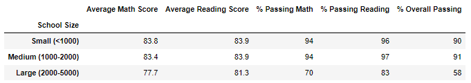

# School_District_Analysis

**## Overview of Project **

The aim of this project was to gather and analyze school sizes, grades,district and charter, school types, average and overall percentages of students who passed both math and reading using pandas. 
There were fifteen schools and four classes, grades nine through twelve. Additionally, a DataFrame was used to visualize the information in a table. Moreover, academic dishonesty was uncovered while conducting the analysis.

**### Results**

Replacing the ninth grade led to:

- The average math score dropping from from 79% to 78.9%.
- The percentage of math decreasing from 75% to 74.8%.
- The percentage of reading decreasing from 75% to 74.8%.
- The overall passing score decreased from 65% to 64.9%.

District Summary:

- Math percentage decreased from 75% to 74.8%
- Overall passing decreased from 65% to 64.9%

School Summary:

- Thomas High school average math score decreased by .07%.
- Thomas High school average reading score increased by .05%.

Spending Summary

Size Summary

**### Summary**

The academic dishonesty that occured caused a domino effect that lead to lower test scores, negative implications for districts to name a few. 
After losing their spot in the top five schools in the district, Thomas highschool regained their top five spot back after exluding the grade nine scores from the dataset.
